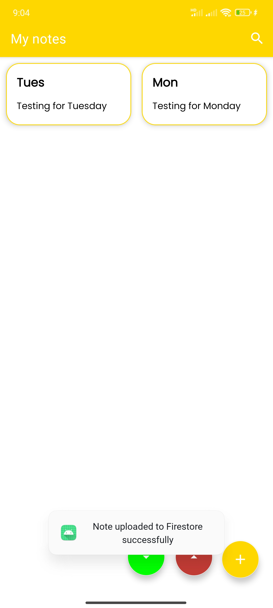

# SNote

This project, developed for the Mobile Programming Course IT4785E (Semester 20241) at HUST, is a simple note-taking application for Android devices. The application enables users to view, search, create, edit, delete, and synchronize notes through cloud storage.

While similar projects are widely available on platforms like GitHub, this repository stands out by including a detailed report and presentation slides, emphasizing the development process and the knowledge gained throughout the course.

# 🚀 Features

*Better to view this README.md in dark mode*

- **View and search notes in the main screen**


- **Add new note**

<table>
  <tr>
    <td></td>
    <td></td>
  </tr>
</table>


- **Edit/Delete note**

<table>
  <tr>
    <td></td>
    <td></td>
  </tr>
</table>

- **Synchronize notes through cloud storage**

<table>
  <tr>
    <td></td>
    <td></td>
  </tr>
</table>

> [!NOTE]  
> To enable synchronization between devices, both must use the same google-services.json file. Instructions for generating this file are provided in the installation section.

# 🛠️ Installation

## 1. Use the apk file

You can simply download the apk file from the [release page](Not availabale yet) to enjoy the application

## 2. Build from source

1. Clone the repository:
    ```sh
    git clone https://github.com/chutrunganh/SNote-IT4785E.git
    ```
2. Open the project in Android Studio, or IntelliJ IDEA.

3. Build the project to download all dependencies.

4. Connect the project to Firebase by following these steps:

    In Android Studio, click on the Tools menu -> Firebase -> Cloud Storage -> get started with Cloud Storage. Follow the instructions to connect the project to Firebase.

    

    It will naviagate you to [Firebase Console](https://console.firebase.google.com), create a new project -> Build -> Firestore Database -> Create Database -> Start in test mode. Then after that, our app is connected to Firebase.


5. Run the application on an emulator or a physical device.


# 💻 Technologies Used

- **Kotlin**: Programming language
- **Room**: Local database for storing notes.
- **Firebase Firestore**: Cloud storage for synchronizing notes.
- **Android Jetpack Components**: Including LiveData, ViewModel, and Navigation.

# 🤝 Contributing

This project is developed by menbers:

| Name           | Student ID |
|----------------|------------|
| Chu Trung Anh  | 20225564   |
| Bui Duy Anh    | 20225563   |

# 📜 License

[](https://opensource.org/licenses/MIT)

This project is licensed under the MIT License - see the [LICENSE](https://opensource.org/license/mit) for details.

# 📧 Contact

This project is maintained by: Chu Trung Anh - [Email](mailto:chutrunganh04@gmail.com).

Feel free to contact me if you have any question or suggestion.


